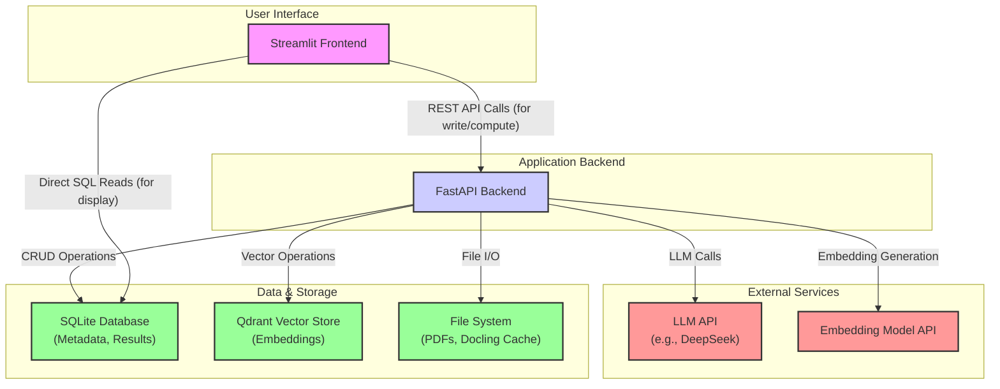

# Structured Data Extraction with a Hybrid RAG System

This repository contains the source code for a Master's Thesis project focused on extracting structured data from complex documents like corporate sustainability and financial reports. The project is a full-stack application implementing a novel, two-stage conversational Retrieval-Augmented Generation (RAG) pipeline.

## 📖 Abstract

The core challenge addressed by this project is the difficulty and inefficiency of manually extracting specific, structured data points from long, unstructured, and semi-structured PDF documents. This application provides an end-to-end solution that leverages Large Language Models (LLMs) to automate this process. It features a unique RAG pipeline that first uses an LLM to evaluate the relevance of retrieved document chunks and then uses the same conversational context to synthesize a final, structured JSON answer. This approach, combined with advanced layout-aware document parsing, provides a powerful tool for accurate and scalable data extraction.

## ✨ Features

- **Full-Stack Application**: A complete, usable application with a web-based frontend and a robust backend.
- **Dynamic Schema Generation**: Users provide a natural language query, and the system uses an LLM to automatically generate a target JSON schema for the data to be extracted.
- **Conversational RAG Pipeline**: A novel two-stage process:
  1.  **Evaluate**: An LLM first assesses each retrieved document chunk for relevance against the query.
  2.  **Synthesize**: The LLM then uses its memory of the evaluated chunks to generate a final, consolidated JSON answer, reducing hallucinations and improving accuracy.
- **Advanced Document Parsing**: Integrates the `docling` library for sophisticated, layout-aware parsing of PDFs, correctly interpreting complex structures like multi-page tables.
- **Table-Aware Chunking**: Employs a `HybridChunker` that serializes tables into a machine-readable format (Markdown), preserving their semantic structure within chunks.
- **Interactive UI**: A Streamlit-based frontend for managing companies, ingesting documents, running queries, and analyzing results.
- **Visual Source Verification**: Renders PDF page snippets with highlighted bounding boxes for each source chunk, allowing users to visually confirm the origin of the extracted data.
- **Performance Optimization**: Utilizes backend threading for non-blocking operations and caching of parsed documents to significantly speed up re-ingestion.

## 🏗️ Architecture

The system is composed of a Streamlit frontend, a FastAPI backend, SQLite and Qdrant databases, and external AI services.



## 🚀 Getting Started

### Prerequisites

- Python 3.10+
- Docker (for the Qdrant vector database)
- An API key from an LLM provider (e.g., DeepSeek)

### Installation

1.  **Clone the repository:**
    ```bash
    git clone https://github.com/MBoekels/structured-data-extraction-rag.git
    cd App
    ```

2.  **Create and activate a virtual environment:**
    ```bash
    # Windows
    python -m venv venv
    .\venv\Scripts\activate

    # macOS / Linux
    python3 -m venv venv
    source venv/bin/activate
    ```

3.  **Install the required dependencies:**
    *(Ensure you have a `requirements.txt` file in the root `App` directory)*
    ```bash
    pip install -r requirements.txt
    ```

4.  **Set up environment variables:**
    Create a file named `.env` in the `App` directory and add your LLM API key.

    ```env
    # .env
    DEEPSEEK_API_KEY="your_deepseek_api_key_here"
    ```

### Running the Application

The application requires multiple components to be running in parallel: two Docker containers for services, the Python backend, and the Python frontend.

**1. Start Required Services (Docker)**

You need two Docker containers running. Open two separate terminals for these commands.

*   **Terminal 1: Start Qdrant**
    This container stores the vector embeddings of your documents.
    ```bash
    docker run -p 6333:6333 -p 6334:6334 \
        --name qdrant-rag-app \
        -v $(pwd)/qdrant_storage:/qdrant/storage \
        qdrant/qdrant
    ```

*   **Terminal 2: Start vLLM Embedding Model**
    This container serves the embedding model. **A GPU with CUDA is required.** Ensure you have the NVIDIA Container Toolkit installed.
    The model name is configured in `config/settings.py` (e.g., `Qwen/Qwen3-Embedding-0.6B`).
    ```bash
    docker run --gpus all -p 8000:8000 \
        --name vllm-embedding-server \
        -v ~/.cache/huggingface:/root/.cache/huggingface \
        ghcr.io/vllm-project/vllm-openai:latest \
        --model Qwen/Qwen3-Embedding-0.6B
    ```
    *Note: The application expects this service at `http://localhost:8000/v1`.*

**2. Start the Backend Server**

This server handles all the application logic. It must run on a different port than the vLLM server. We'll use port 8001.

*   **Terminal 3: Start FastAPI**
    Navigate to the `App` directory and run:
    ```bash
    uvicorn backend.main:app --reload --port 8001
    ```
    The API will be available at `http://127.0.0.1:8001`. You can view the auto-generated documentation at `http://127.0.0.1:8001/docs`.
    *(Important: Ensure the `API_BASE` variable in your frontend's configuration points to `http://127.0.0.1:8001`)*

**3. Start the Frontend Application**

*   **Terminal 4: Start Streamlit**
    Open a new terminal, navigate to the `App` directory, and run:
    ```bash
    streamlit run Dashboard.py
    ```
    The web application will be available at the local URL displayed in your terminal (usually `http://localhost:8501`).

## 💻 Usage Workflow

1.  **Navigate to the "Companies" page:** Create a new company profile.
2.  **Navigate to the "Ingestion" page:** Select a company, upload a PDF report, and click "Ingest Document".
3.  **Navigate to the "Queries" page:** Enter a new question you want to ask about the documents (e.g., "What were the total CO2 emissions in 2022 and 2023?") and click "Create Query".
4.  **Navigate to the "Analysis" page:** Select the company and the query you just created, then click "Run Analysis".
5.  **Navigate to the "Results" page:** The results of your analysis will appear. You can filter by company or query and expand each result to see the structured JSON answer and its sources.

## 📂 Project Structure

```
App/
├── backend/            # FastAPI application, business logic, RAG pipeline
│   ├── __init__.py
│   ├── database.py     # SQLite database management
│   ├── llm_services.py # LLM and embedding model clients
│   ├── main.py         # FastAPI endpoints
│   ├── processing.py   # Docling parsing and chunking logic
│   └── vector_store.py # Qdrant vector store management
├── data/               # Data storage (SQLite DB, docling cache)
├── frontend/           # Streamlit application pages
│   ├── Dashboard.py
│   └── pages/
├── tests/              # Pytest tests for the backend
├── uploads/            # Storage for uploaded PDF files
├── .env                # Environment variables (API keys)
├── README.md           # This file
└── requirements.txt    # Python dependencies
```

## 🙏 Citations & Acknowledgements

This project was made possible by a number of fantastic open-source libraries. Their contributions are gratefully acknowledged.

- **FastAPI:** For the robust and high-performance backend API.
- **Streamlit:** For the interactive and easy-to-build frontend.
- **Qdrant:** As the high-performance vector database for semantic search.
- **LangChain:** For orchestrating interactions with LLMs and managing prompts.
- **docling:** For advanced, layout-aware PDF parsing and table extraction.
- **pypdfium2:** For efficient rendering of PDF pages in the frontend.
- **Pydantic:** For data validation and settings management throughout the application.

## 📄 License

This project is licensed under the MIT License. See the `LICENSE` file for details.
